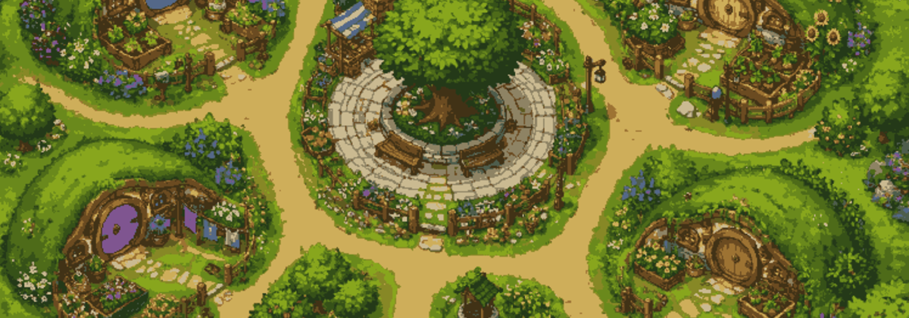

# heartleaf - A cozy multiplayer garden dinner game.

`nimby install heartleaf`


[API reference](https://treeform.github.io/cogame-heartleaf)

## About

Heartleaf is a small BitWorld sprite protocol game about growing food,
collecting vegetables from garden plots, hiding in houses, and gathering for
dinner in the evening.

Players connect over websockets at `/player`. The browser sprite client is
served at `/client/player`, and the global observer is served at
`/client/global`.

> **AI disclaimer: Much of this game was AI generated.**

## Gameplay

- Each garden starts the day with one random vegetable.
- Gardens with food show an exclamation marker.
- Press A near a garden to collect its vegetable.
- Inventory appears in the bottom-right UI layer.
- Stand inside a house and press A to hide inside it.
- Press A again to come back out.
- Player 1 spawns near house 1, player 2 near house 2, and so on through
  player 9.

## Running Locally

```sh
nim r src/heartleaf.nim
```

Then open:

- `http://localhost:8080/client/player`
- `http://localhost:8080/client/global`

For a short smoke run:

```sh
nim r src/heartleaf.nim -- --maxTicks:120 --maxGames:1
```

## Project Layout

- `src/heartleaf.nim` contains the game server and simulation.
- BitWorld is used as a Nimble dependency for shared sprite protocol helpers.
- `data/` contains map, sprite, font, and Figma resource data.
- `clients/` contains the static sprite protocol web client.
- `tests/tests.nim` contains smoke checks.

## License

MIT
