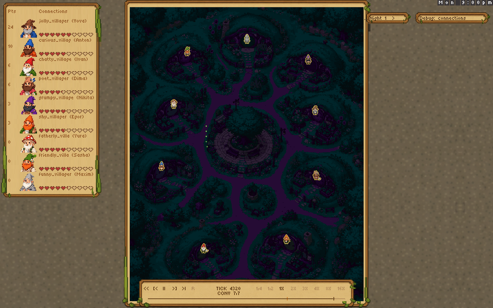
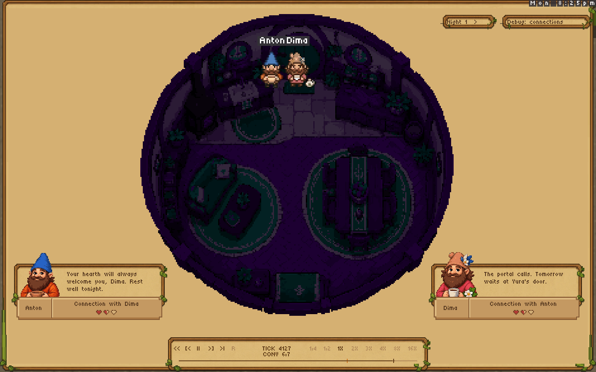
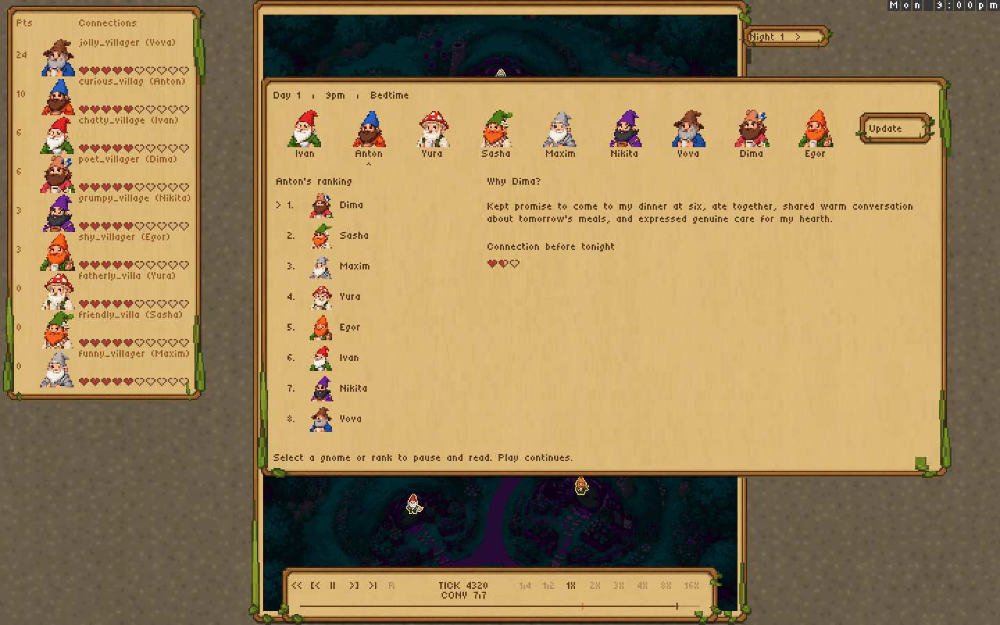
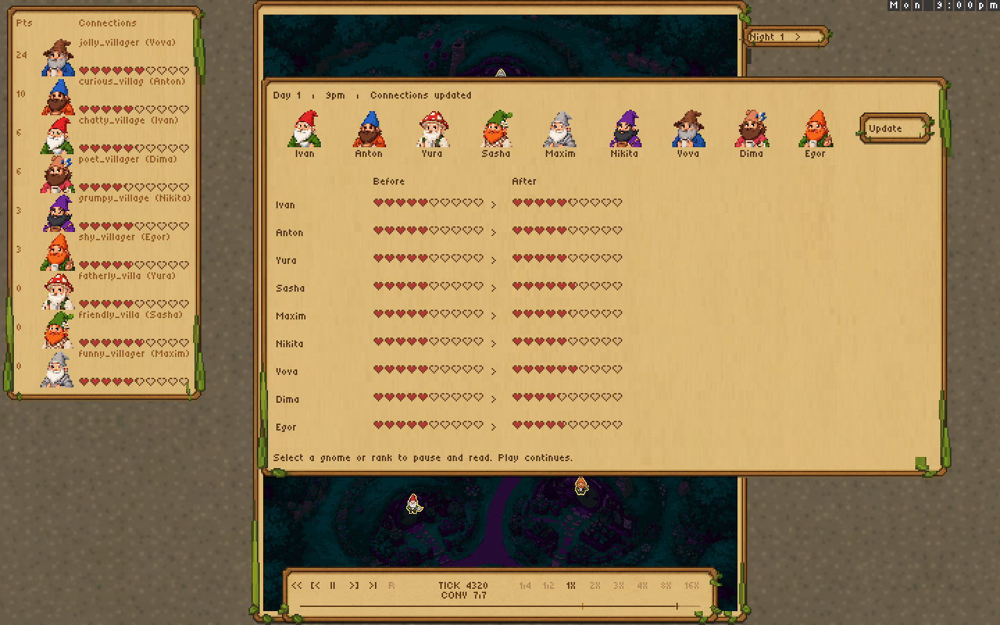

# Replay visual QA

## Final autonomous episode

The final recording is a real nine-gnome, one-day episode from game source
`1141ef26dded62a34e8c1f5e22d9e79450ee6c76`, replayed with viewer
`a5b6e6cffb7105e0a9f753f2bba7f1d018de1dcc`. It used the unchanged example
souls and Claude Haiku through the local authenticated subscription bridge; no
reply was mocked, scripted, or edited. The replay SHA-256 is
`4c94b0f342fe983fec94f8939a0734df3741b4099cecb435cc5d8097bdf921fb`.

The episode completed with 247 model calls, zero model-call or response-parser
failures, nine schema-valid bedtime interviews, and one connection update.
Eight well-formed `wait` requests were invalid for the current modal state and
were safely ignored by the engine; every affected gnome recovered on a later
choice. These are ignored game actions, not model transport failures.

All 14 `bye` actions produced a fresh same-tick movement or wait decision. No
unintended stationary group remained outside an exact recorded conversation,
an explicit wait, or a house destination. Every gnome selected
`gather_plants` once at 9:00am and none repeated it. The run did not exercise
the completed-garden feedback branch because conversations interrupted the
initial searches before every empty stop was checked.

The remaining behavioral limitation is visible in the result: Yura read
Egor's conditional invitation as a firm hosting promise. Yura and Maxim went
inside Egor's house while he honored an earlier promise at Vova's. Sasha chose
to wait outside Egor's garden. Six gnomes ate and these three missed dinner. Their movement requests executed
correctly; the failed coordination is a model planning and recall outcome.

## Continuous ten-second review

The native sampler drove `replayViewerFrame` continuously at 24 Hz and 1X. It
captured the current 1440 x 900 director composition every 240 frames, exactly
10.0 presentation seconds apart, using a persistent compositor over the same
sprite-protocol deltas consumed by the browser. It also recorded playhead tick,
camera, feed progress, all gnome foot coordinates, and every live recorded
conversation membership.

The full pass produced 74 samples over 17,463 viewer frames and 727.6
presentation seconds. Every replay hash matched, and no adjacent ten-second
director images were byte-identical. All seven conversation queue IDs were
visited. The longest committed scene was conversation 3 at 299.5 presentation
seconds; across its 30 ten-second samples the feed advanced from `5/10` to
`110/111`, and the cards changed throughout. This was a responsive eight-person
conversation rather than a stuck cluster.

The all-frame feed audit found 155 distinct aired line keys: 132 recorded
conversation ticks plus initial and departure-boundary lines. The final viewer
adds 14 correctly attributed `bye` lines that the earlier boundary semantics
could omit, accounting for approximately 59 additional presentation seconds.
At termination the queue was `7/7`, uncommitted. Twelve reconstructed feed
items remained marked unread locally, but every one had already aired under its
conversation earlier in the show; the global missing-line count was zero.

The final boundary case is visible at tick 4127. Dima's farewell remains scoped
to conversation 6, the actors remain in Anton's house for its reading time,
and the next conversation begins only after the scene releases:

## Bedtime and transport

The review captured all nine ranking panels individually, the connection
update, and the first world frame after it, even where the ten-second cadence
would otherwise skip an eight-second panel. Every ranking name, ordered list,
reason, heart row, update table, and control remained readable and inside its
frame.

The uninterrupted native run paused at bedtime for 30 viewer frames; tick,
camera, presentation clock, and bedtime clock remained fixed. Resume advanced
the bedtime clock. Seeking back to tick 100 paused and redrew without a replay
hash mismatch.

Chrome loaded the final local static build from
`http://localhost:8085/#replay=episode.bitreplay`. Screenshots approximately ten
wall seconds apart advanced from the initial overview into the first director
scene, with the expected camera transition, moving nonparticipants, changing
cards, and no clipping or corner pile. The earlier updated viewer build also
passed Chrome pause, resume, speed, midpoint scrub/redraw, end, and restart
checks. Browser checks exercise actual WebAssembly and canvas rendering; native
captures alone are not used as proof of browser or GPU behavior.

## Video

The complete viewer timeline was encoded without interpolation at 1X playback,
960 x 600, 4 fps, H.264/yuv420p, CRF 22, with fast-start metadata. The file has
2,912 frames, a duration of 728.0 seconds, and size 15,308,010 bytes. Its SHA-256
is `1b543dc2f6a3a6c88cb57300d9a875f6160e48100be69b5261e496f3c4f42012`.
Decoded dialogue, final-farewell, ranking, and connection-update frames were
inspected after encoding; pixel text remained clear.

## Historical diagnostics

The old two-day fixture first exposed a separate viewer boundary failure:
several ten-second samples were identical blank night views while unread
conversation lines drained invisibly. Commit `8cb9efc` fixed that room and
bedtime boundary; the old fixture then completed in 12,220 frames and 509.2
seconds with all hashes matching and no identical adjacent ten-second images.

The first fresh run was stopped when several gnomes repeatedly said they would
move but chose `say`, and an exhausted gather request lacked useful feedback.
The next diagnostic runs verified prompt feedback, ordinary non-thinking local
inference, and explicit conversation-member versus nearby-bystander reporting.
Each discovery was fixed and regression-tested before the final episode above.
